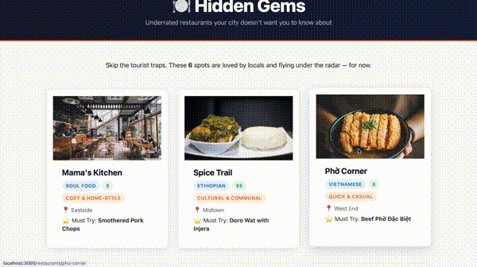

# 🍽️ Hidden Gems

A web app that highlights underrated local restaurants flying under the radar — loved by locals, unknown to tourists. Now powered by a PostgreSQL database hosted on Render!

## 📸 Walkthrough

<!-- GIF -->


Walkthrough GIF 2:-


## ✅ Required Features

- [x] The web app uses only HTML, CSS, and JavaScript without a frontend framework
- [x] Data is supplied to the app using a Render PostgreSQL database
  - [x] The web app is connected to a Render PostgreSQL database
  - [x] The database contains an appropriately structured table for the list items

## ✅ Project 1 Features (carried over)

- [x] Front page of web app is functional and appropriately styled
- [x] The web app displays a title
- [x] Website displays at least five unique list items
- [x] Each list item includes at least three displayed attributes (cuisine, price range, vibe, neighborhood, must-try dish)
- [x] Each list item has a corresponding detail page (e.g., `localhost:3000/restaurants/mamas-kitchen`)
- [x] The web app serves an appropriate 404 page when no matching route is defined
- [x] The webpage is styled with Picocss

## 🌟 Stretch Features

- [x] List items are displayed as cards in a responsive grid layout
- [x] Users can search for items with a specific attribute (search restaurants by cuisine)

## 🚀 How to Run

1. Install dependencies:

```bash
   npm install
```

2. Create a `.env` file in the project root with your Render PostgreSQL connection string:
3. Set up and seed the database (run once):

```bash
   node server/config/setupDB.js
```

4. Start the server:

```bash
   npm start
```

5. Open [http://localhost:3000](http://localhost:3000)

## 🛠️ Tech Stack

- **Backend:** Node.js + Express
- **Database:** PostgreSQL (hosted on Render)
- **Frontend:** Vanilla HTML, CSS, JavaScript
- **Styling:** Picocss + custom CSS

## 📂 Project Structure  listicle/

├── client/

│   └── src/

│       └── css/

│           └── style.css

├── server/

│   ├── config/

│   │   └── setupDB.js

│   ├── views/

│   │   └── 404.html

│   └── server.js

├── .env (not committed)

├── .gitignore

├── package.json

└── README.md.  ## 🗄️ Database Schema

**Table: `restaurants`**

| Column        | Type           | Description                       |
|---------------|----------------|------------------------------------|
| id            | TEXT (PK)      | Unique slug identifier              |
| name          | TEXT           | Restaurant name                     |
| cuisine       | TEXT           | Type of cuisine                     |
| price_range   | TEXT           | Price range ($, $$, $$$)            |
| neighborhood  | TEXT           | Neighborhood/location                |
| must_try      | TEXT           | Recommended dish                    |
| vibe          | TEXT           | Atmosphere/vibe description          |
| rating        | NUMERIC(2,1)   | Rating out of 5.0                   |
| description   | TEXT           | Full description of the restaurant  |
| image         | TEXT           | URL of restaurant image              |

## 💭 Notes / Reflection

Refactoring the app to use a database mainly involved replacing the hardcoded `restaurants` array in `server.js` with PostgreSQL queries via the `pg` library, and creating a `setupDB.js` script to create and seed the `restaurants` table on a Render-hosted Postgres instance. The frontend markup and styling stayed largely the same since the data shape (column names) was kept consistent with the original list item structure. 
